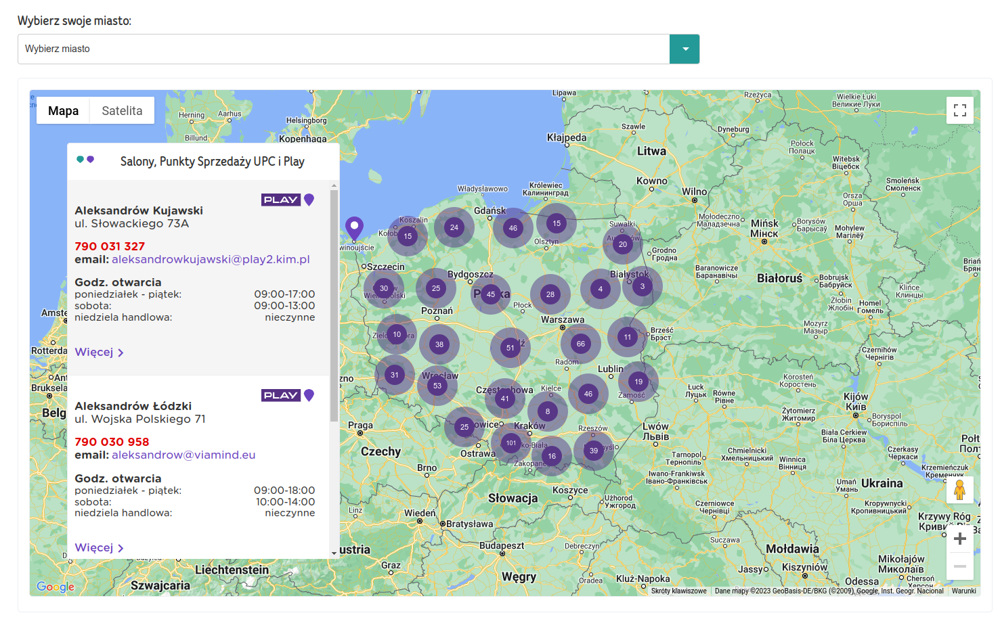

# UPC Salony

This project was generated with [Angular CLI](https://github.com/angular/angular-cli) version 14.2.8.

## Development server

Run `ng serve` for a dev server. Navigate to `http://localhost:4200/`. The application will automatically reload if you change any of the source files.

## Preview

 

## Description

The UPC Showroom Locator is an interactive web application developed for UPC Poland, designed to assist customers in effortlessly locating UPC showrooms across the country. Leveraging the power of Angular and the Angular Google maps plugin, the application provides a user-friendly, intuitive map interface where users can view the exact locations of UPC showrooms, get essential details, and plan their visits conveniently.
